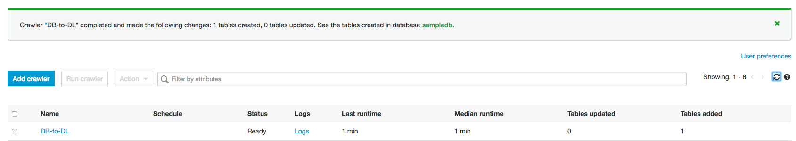

# Module 2: Connect, discover and extract data from your MySql database using AWS Glue

In this module you will connect to your RDS MySql Database, discover and extract data into your Data Lake on S3 using AWS Glue.


### 2A: Create AWS Glue Crawler 

In this step, we will use a CloudFormation template to provision the RDS MySql database which we will need in later steps of the workshop.


<details>
<summary><strong>AWS Glue Crawler creation Instructions (expand for details)</strong></summary><p>

1. Go to [AWS Glue](https://console.aws.amazon.com/glue/home?region=us-east-1) on the console.

1. On the left pane, select **Crawlers** then Click **Add Crawler** .

1. Enter a ```DB-to-DL``` as **Crawler name** and click **Next** .

1. On the Add a data store page, click on the dropdown and select **JDBC** on the **Choose a data store** option and click **Add connection**.

1. On the Add connection page, enter ```RDSMySql``` as **Name** and **JDBC** as **Connection type** .
	For the JDBC URL, enter ```jdbc:mysql://endpoint:3306/MyDatabase``` and replace endpoint with your database endpoint.

1. Enter the database username and password. 

1. From the dropdown menu, select the VPC where your RDS instance is.

1. From the drop down menu, select the one of the subnet your RDS instance uses. (Check the **details** section of the RDS instance page on the AWS Console for this information).

1. For security group, select one or more the Security groups that allows access to the data store in your VPC. Ensure the security group defined to allow **Security Group - Inbound** to your RDS instance is selected. This security group can be found on the **details** section of the RDS instance page on the AWS Console.Then click **Add**

1. This takes you back to the Add Crawler wizard. On the Add a data store page, enter ```MyDatabase``` in the include path field then click **Next**

1. Select **NO** on the Add another data store page the click **Next**

1. On the **Choose an IAM** role page, Click on the IAM role dropdown and select an existing role which has AWSGlueServiceRole and access to your data stores. If you don't have an existing role with these policies, you can create on from the IAM console by clicking the IAM console link on Choose an IAM role page. This will the IAM console on a new tab. After creating the role, you need to click the reload icon next to the IAM role drop down to display your newly created role.

	Select the the role and click **Next**

1. On the **Create a schedule for this crawler** page, select Run on Demand on the Frequency dropdown and click **Next**

1. On the Configure the crawler's output page, select the database (in your data lake) that you want the extracted data to be stored. You can create a new database here if you want. 

1. Enter a prefix for the tables created so you can easily recognise them. You can enter ```rds_mysql_```

1. Review the entries and click **Finish** to complete the crawler creation.

	You can test that your connection is properly configured by clicking the **Connections** menu on the left of the AWS Glue console page, selecting the checkbox next to your newly created Connection then click the **Test Connection** button. The test will take a few minutes and you will be informed if connection to your RDS instance from AWS Glue is successful or not. 


</p></details>


### 2B: Run the crawler

Run the DB-to-DL crawler

<details>
<summary><strong>Step-by-step instructions (expand for details)</strong></summary><p>

1. On the [Crawlers page](https://console.aws.amazon.com/glue/home?region=us-east-1#catalog:tab=crawlers), select the checkbox next to your newly created crawler and click the **Run crawler** button. If all the configuration is correct, the status of the crawler should change to **starting**

1. Copy, paste and run the query on your SQL Client to create a table and load it with data.   

</details>


### 2C: Verify crawler discovered and extracted data from database into data lake

Once the cralwer completes running, it displays a message informing you of how many tables were added or updated. 


 

### Next module


After you have verified your database contains data, move onto the next module: [Connect, discover and extract data from your MySql database using AWS Glue](2_ExtractDataWithGlue)

