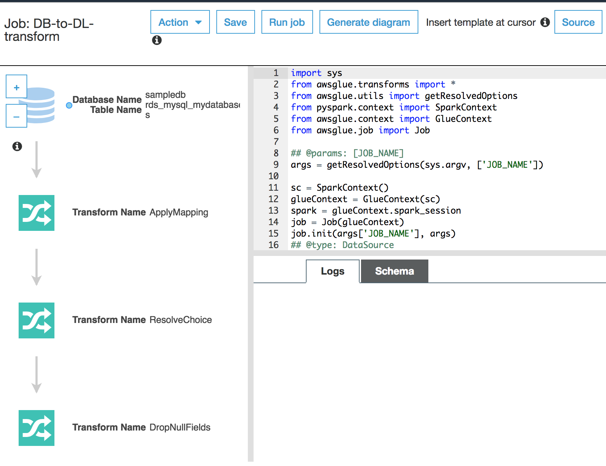
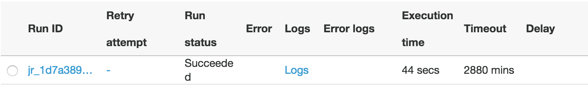
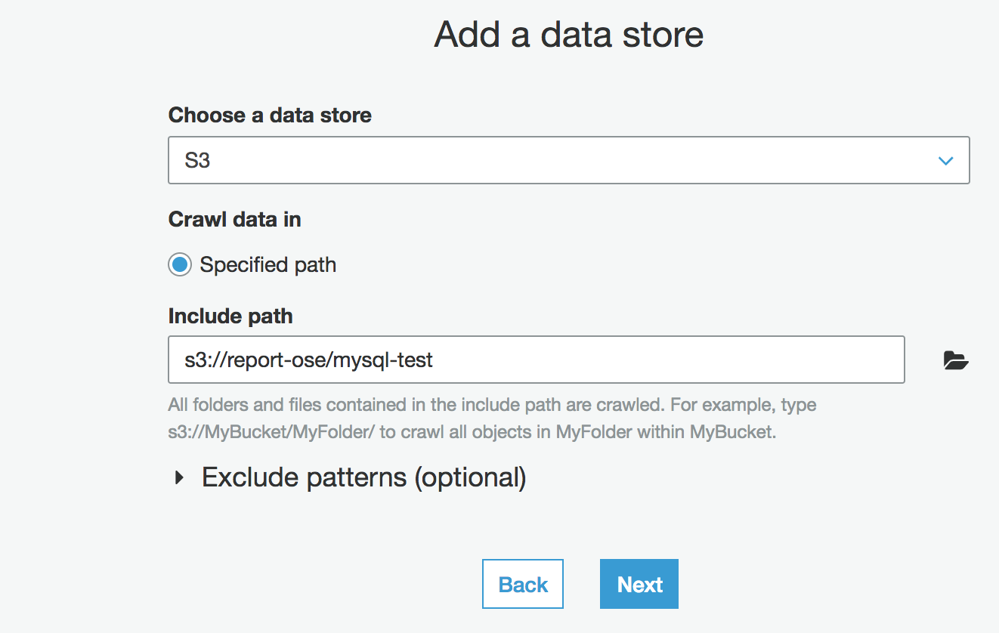

# Module 3: Transform your data in your Data lake from MySql format to Parquet format with AWS Glue

In this module you create a serverless transformation job in AWS Glue to transform your newly extracted data from MySql format into Parquet format in preparation for serverless querying.


### 3A: Create and Run an AWS Glue Job 

In this step, we will create an AWS Glue job to perform transformation of data from MySql format to Parquet format .

<details>
<summary><strong>AWS Glue Job creation Instructions (expand for details)</strong></summary><p>

1. Go to [Amazon S3](https://s3.console.aws.amazon.com/s3/home?region=us-east-1) on the console and create a new bucket. Give it any name you like.

1. Go to [AWS Glue](https://console.aws.amazon.com/glue/home?region=us-east-1) on the console.

1. On the left pane, under the ETL section, select **Jobs** then Click **Add Job** .

1. Enter a ```DB-to-DL-transform``` as **Job name** .

1. Select the an exisitng IAM role or Create a new one which has permission to your Amazon S3 sources, targets, temporary directory, scripts, and any libraries used by the job.

1. On the **This job runs** section, select **A proposed script generated by AWS Glue**

1. FOr **ETL language**, select ***Python***

1. You can choose to leave the remaining configurations on their default settings and click **Next**.

1. On the **Choose a data source** page, select the table extracted by your AWS Glue Crawler. Ensure that the classification is stated as ```mysql``` and click **Next**

1. On the **Choose a data target** page, select **Create tables in your data target** option

1. Under **Data store**, select **Amazon S3**. Under **Format**, select **Parquet**, Under **Target path**, select the S3 bucket you created in step 1 then click **Next**.

1.On the **Map the source columns to target columns** page, click **Next** and click **Save job and edit script** on the job Review section. 

1. The code and diagram for the job will be dispayed now as shown below

	

1. Click **Run job** and on the pop up menu, also click **Run job**. The job will begin running and it should take a few minutes to complete.

1. To check the status of the job, go the AWS Glue console and click **Jobs** select the job from the job list by checking the checkbox next to the job. A window with several tabs will appear beneath the job list. Select the **History** which will show you the **Run status** of the job. If the job is successful, the run status will be displayed as ```Succeeded``` . 
	
	See below for a sample screenshot
	
	


</p></details>


### 3B: Create and run a new crawler to add the new table

Create and run a new crawler to discover and add the new Parquet table to your Data lake. The steps are similar to the steps in [Module 2](..2/) but ensure to choose S3 in the **Add a data store** page and select the S3 location of your transform data you defined in your AWS Glue transformation job. 


	
Run the crawler and check the for the new tables created.
 

### Next module


After you have verified that your AWS Glue crawler has successfully extracted data from your S3 bucket into your data lake, move onto the next module: [Serverlessly query your data using Amazon Athena](../4_QueryWithAthena)

