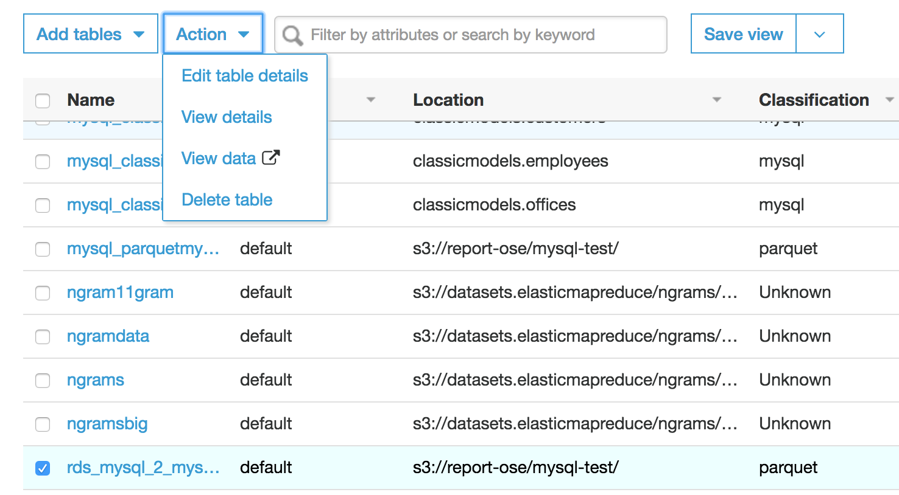
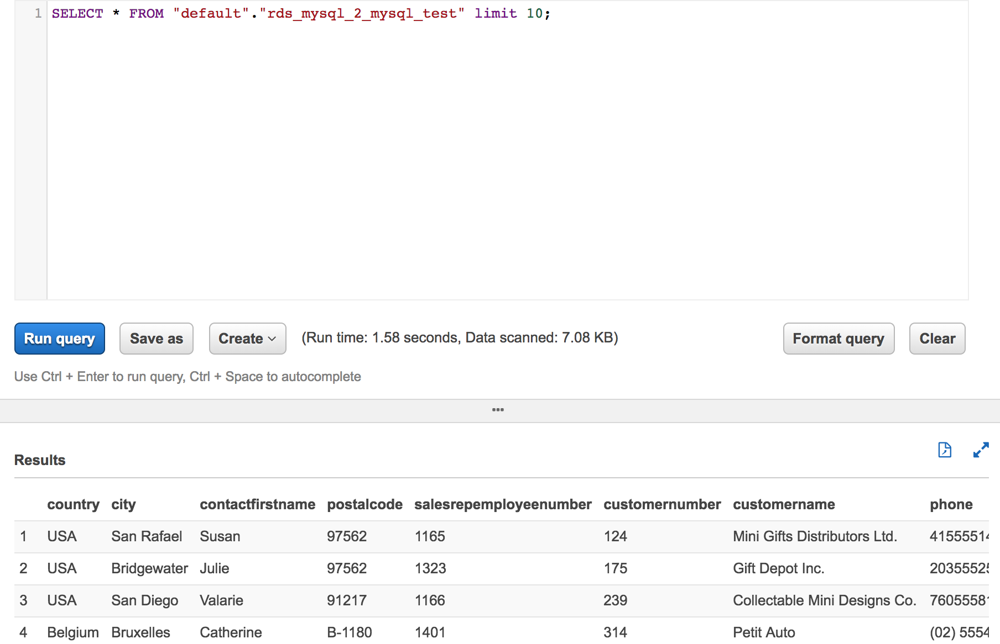

# Module 4: Serverlessly query your data using Amazon Athena

Firstly, congratulations for reaching the last module in this tutorial. In this module you access and query the data that was extracted from your RDS MySql database and transformed to Parquet format.This data will be queried directly from the your data lake without loading it into a database or data warehouse using Amazon Athena. 


1. Go to [AWS Glue](https://console.aws.amazon.com/glue/home?region=us-east-1) on the console.

1. On the left pane, under the Data catlog section, select **Tables**.

1. Select the checkbox beside the table name and click the **Action** dropdown button to reveal different actions you can perform on the table.
	
	

1. To access the data in the table, select the **view data** option. This will open up Amazon Athena in a new tab with a query and result window as shown below

	
	
1. You can type and run any SQL query in the query window and the result will be displayed in the result window. For example, let us run a query to return all records which has Country value as USA. TO do this, copy, paste and run the following query in Amazon Athena ```SELECT * FROM "rds_mysql_2_mysql_test" where country ='USA';``` . Ensure to change the table name ```rds_mysql_2_mysql_test``` to your table name.

1. You can use Amazon Athena to run any other query you like against the data which is stored in your data lake ad you are charged for only the amaount of data scanned. 


